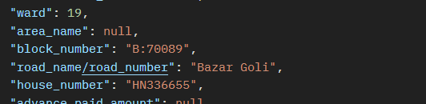
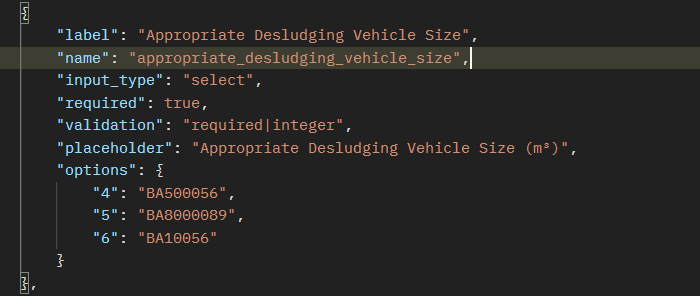

# API changes 

---

## Emptying get api

- added new fields which should be shown as :
- endpoint : https://dncc.innovativesolution.com.np/api/assessed-applications

## Supervisory Assessment get api :

- added new field not necessary to be shown in the card

# Supervisory Assessment getformfields : 

- before call endpoint like this :
  https://dncc.innovativesolution.com.np/api/assessedsupervisory-applications-fields
  now :  pass application_id as a param like this to fetch the form fields
  https://dncc.innovativesolution.com.np/api/assessedsupervisory-applications-fields/28
- Before :  Form Field Appropriate Desludging Vehicle Size was a numeric user input field but
- Now :  its a select option field
  
