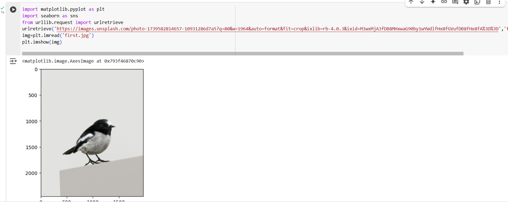

# This covers the classly learned things in here 

# Data

years = [2001, 2002, 2003, 2004, 2005]
apples = [50, 60, 55, 70, 65]
oranges = [40, 50, 45, 60, 55]

# Stacked Bar Plot

plt.bar(years, oranges, width=0.4, color='orange', alpha=0.6, label="Oranges")
plt.bar(years, apples, width=0.4, color='blue', alpha=0.6, bottom=oranges, label="Apples")

# Labels and title

plt.xlabel("Years")
plt.ylabel("Fruit Production")
plt.title("Apples and Oranges Production Over the Years")
plt.legend()
plt.grid(True)

# Show plot

plt.show()

---

# Pivot

---

use df.head to print as well

# HeatMap

---

for density

* [ ] importances :

fmt : d for decimal
can also plot add x and y value titles as well

# import url lib

# url retrieve

---

for openening image using PIL

