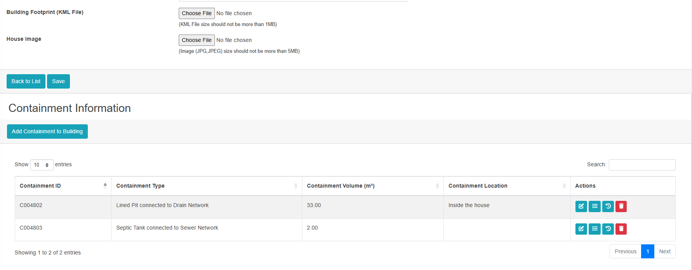

# Containment Requirement (Mobile App)

### 1. Containment Integration in Building Form

* At the  **end of the Building Form** , there should be an option to  **Add Containment** .
* A **datatable view** for the Containment table should be displayed (similar to the web version of the Building Edit Form).

  
* The user should be able to:

  * **Add new containment**
  * **Edit containment**
  * **Delete containment**

  ### Code Reference :

  - **Containment Form + Logic:**

    [https://github.com/dncc-imis/web_app/tree/master/resources/views/fsm/containments](https://github.com/dncc-imis/web_app/tree/master/resources/views/fsm/containments)

    ### Backend References :
  - **Containment Controller:
    [https://github.com/dncc-imis/web_app/blob/master/app/Http/Controllers/Fsm/ContainmentController.php](https://github.com/dncc-imis/web_app/blob/master/app/Http/Controllers/Fsm/ContainmentController.php)**
  - **Containment Service:
    [https://github.com/dncc-imis/web_app/blob/master/app/Services/Fsm/ContainmentService.php](https://github.com/dncc-imis/web_app/blob/master/app/Services/Fsm/ContainmentService.php)**

### Website URL :

https://dncc.innovativesolution.com.np

**CREDENTIALS :
superadmin@gmail.com
$uper@dm!n@2024**

---

### 2. House Image Requirement

* In the  **Building Edit Form** :
  * If a **House Image** is already uploaded → the user should only be able to **view or update** it.
  * If a **House Image** is not present → the user should be able to **add** it.

---

### 3. Building KML Requirement

* Users should not be able to  **edit/update/add the Building KML for now** .
